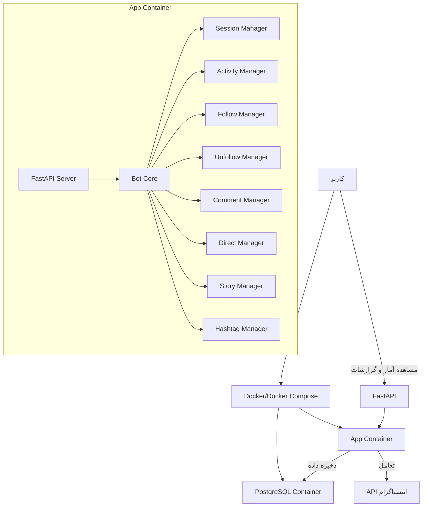
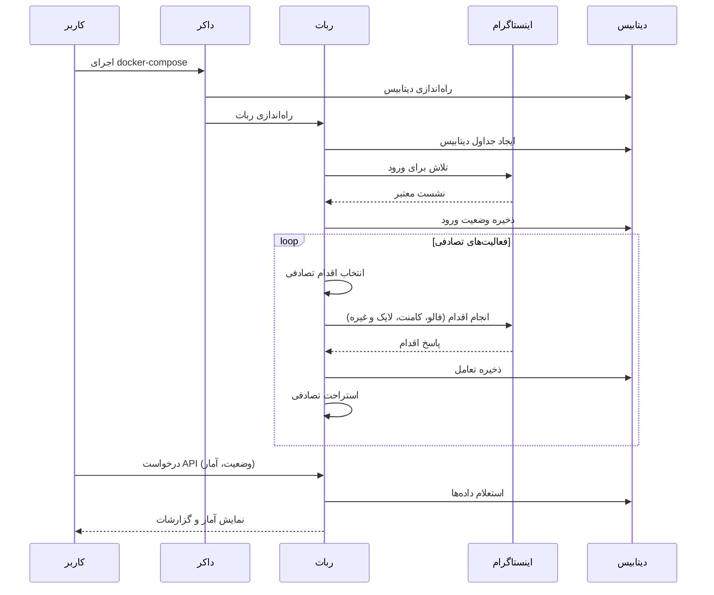
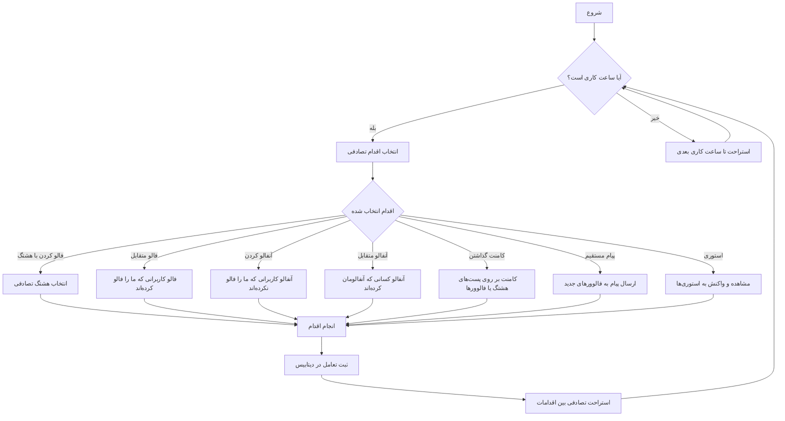

# Instagram Bot


یک ربات هوشمند اینستاگرام با قابلیت‌های تعاملی طبیعی که از طریق Docker اجرا می‌شود و داده‌ها را در PostgreSQL ذخیره می‌کند.

## ویژگی‌ها

- 🔄 **تعاملات اتوماتیک**: فالو، آنفالو، کامنت، لایک، پیام مستقیم و مشاهده استوری
- 🌐 **تعامل با هشتگ**: جستجو و تعامل با پست‌ها بر اساس هشتگ‌های فارسی
- 🧠 **هوشمند و انسانی**: الگوریتم رفتاری طبیعی با وقفه‌های تصادفی و استراحت بین فعالیت‌ها
- 📊 **API مانیتورینگ**: دسترسی به آمار و عملکرد ربات از طریق FastAPI
- 🔒 **مدیریت نشست**: ذخیره‌سازی نشست کاربری برای جلوگیری از ورود مجدد
- 🐳 **داکرایز شده**: اجرای ساده و بدون نیاز به تنظیمات پیچیده

## معماری سیستم



## جریان کاری ربات



## نحوه راه‌اندازی

### پیش‌نیازها

- Docker و Docker Compose
- یک اکانت اینستاگرام

### مراحل راه‌اندازی

1. **کلون کردن مخزن**:
   ```bash
   git clone https://github.com/yourusername/instagram-bot.git
   cd instagram-bot
   ```

2. **ویرایش فایل .env**:
   ```
   # Database
   DB_USER=instabot
   DB_PASSWORD=instabot_password
   DB_NAME=instabot_db
   DB_PORT=5432

   # Instagram
   INSTA_USERNAME=your_instagram_username
   INSTA_PASSWORD=your_instagram_password

   # API
   API_PORT=8000
   ```

3. **ساخت و اجرای کانتینرها**:
   ```bash
   docker-compose up --build
   ```

4. **دسترسی به API**:
   ```
   http://localhost:8000/docs
   ```

## ساختار پروژه

```
instagram-bot/
├── docker-compose.yml      # تنظیمات داکر کامپوز
├── Dockerfile              # فایل داکر برای ساخت ایمیج
├── requirements.txt        # وابستگی‌های پایتون
├── .env                    # متغیرهای محیطی
├── app/
│   ├── __init__.py
│   ├── main.py             # نقطه ورود اصلی برنامه
│   ├── config.py           # تنظیمات برنامه
│   ├── database/           # لایه دیتابیس
│   │   ├── __init__.py
│   │   ├── models.py       # مدل‌های SQLAlchemy
│   │   └── db.py           # اتصال دیتابیس
│   ├── bot/                # منطق اصلی ربات
│   │   ├── __init__.py
│   │   ├── session_manager.py  # مدیریت نشست اینستاگرام
│   │   ├── comment.py      # عملیات کامنت
│   │   ├── direct.py       # ارسال پیام مستقیم
│   │   ├── story.py        # تعامل با استوری
│   │   ├── follow.py       # مدیریت فالو
│   │   ├── unfollow.py     # مدیریت آنفالو
│   │   ├── hashtags.py     # مدیریت هشتگ‌ها
│   │   └── activity.py     # مدیریت فعالیت‌ها
│   ├── api/                # API های FastAPI
│   │   ├── __init__.py
│   │   ├── router.py       # مسیرهای API
│   │   └── schemas.py      # مدل‌های Pydantic
│   └── utils/
│       ├── __init__.py
│       └── logger.py       # سیستم ثبت لاگ
└── data/                   # داده‌های ذخیره شده
    ├── logs/               # لاگ‌ها
    ├── session.json        # فایل نشست اینستاگرام
    └── hashtags.txt        # لیست هشتگ‌ها
```

## APIهای موجود

### وضعیت ربات
```http
GET /api/status
```

نمونه پاسخ:
```json
{
  "is_running": true,
  "last_login": "2025-03-17T20:45:28",
  "last_activity": "2025-03-17T20:54:04",
  "follows_today": 5,
  "unfollows_today": 3,
  "comments_today": 2,
  "likes_today": 10,
  "direct_messages_today": 1,
  "story_views_today": 15,
  "story_reactions_today": 4,
  "error_count": 0,
  "last_error": null,
  "last_error_time": null
}
```

### آمار ربات
```http
GET /api/stats?time_range=daily
```

بازه‌های زمانی قابل انتخاب:
- `daily`: روزانه
- `weekly`: هفتگی
- `monthly`: ماهانه
- `six_months`: شش‌ماهه
- `yearly`: سالانه

### تعاملات ربات
```http
GET /api/interactions?time_range=weekly&page=1&limit=20
```

### لیست فالوورها
```http
GET /api/followers?page=1&limit=20
```

### لیست فالوئینگ‌ها
```http
GET /api/following?page=1&limit=20
```

## الگوریتم انتخاب فعالیت



## تنظیمات رفتار ربات

تنظیمات رفتار ربات در فایل `app/config.py` قابل تغییر است:

```python
BOT_CONFIG = {
    "max_interactions_per_day": 150,  # مجموع تعاملات روزانه
    "max_follows_per_day": 50,
    "max_unfollows_per_day": 50,
    "max_comments_per_day": 20,
    "max_likes_per_day": 80,
    "max_direct_messages_per_day": 10,
    "max_story_views_per_day": 100,
    "min_delay_between_actions": 30,  # حداقل تأخیر بین اقدامات به ثانیه
    "max_delay_between_actions": 180,  # حداکثر تأخیر بین اقدامات به ثانیه
    "working_hours": {
        "start": 8,  # ساعت شروع فعالیت (8 صبح)
        "end": 23,  # ساعت پایان فعالیت (11 شب)
    }
}
```

## استراتژی‌های فالو/آنفالو

1. **فالو کردن با هشتگ**: ربات کاربرانی که در هشتگ‌های مشخص شده فعال هستند را فالو می‌کند.
2. **فالو متقابل**: کاربرانی که ربات را فالو کرده‌اند اما ربات آنها را فالو نکرده را فالو می‌کند.
3. **آنفالو کردن غیرفالوکنندگان**: کاربرانی که ربات آنها را فالو کرده اما آنها ربات را فالو نمی‌کنند و چند روز گذشته است را آنفالو می‌کند.
4. **آنفالو متقابل**: کاربرانی که قبلاً ربات را فالو می‌کردند اما الان آنفالو کرده‌اند را آنفالو می‌کند.

## نکات امنیتی

برای جلوگیری از مسدود شدن اکانت اینستاگرام، ربات:

1. **استراحت می‌کند**: بین فعالیت‌ها استراحت تصادفی دارد.
2. **محدودیت دارد**: تعداد تعاملات روزانه محدود است.
3. **ساعات کاری دارد**: فقط در ساعات مشخص شده فعالیت می‌کند.
4. **طبیعی عمل می‌کند**: الگوهای رفتاری طبیعی و تصادفی دارد.

## راه‌اندازی مجدد

در صورت نیاز به راه‌اندازی مجدد یا اعمال تغییرات:

```bash
# متوقف کردن کانتینرها
docker-compose down

# ساخت و اجرای مجدد
docker-compose up --build
```

## عیب‌یابی

### خطا در اتصال به دیتابیس
اطمینان حاصل کنید که متغیرهای محیطی دیتابیس در فایل `.env` به درستی تنظیم شده‌اند.

### خطا در ورود به اینستاگرام
- اطمینان حاصل کنید که نام کاربری و رمز عبور صحیح است.
- اطمینان حاصل کنید که حساب شما محدودیت امنیتی نداشته باشد.
- در صورت فعال بودن تایید دو مرحله‌ای، ممکن است ورود با مشکل مواجه شود.

## اخطار

استفاده از ربات‌ها ممکن است ناقض قوانین اینستاگرام باشد و می‌تواند منجر به محدودیت‌ها یا مسدود شدن حساب کاربری شود. استفاده از این ربات با مسئولیت خودتان است.